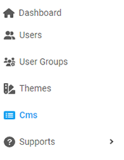
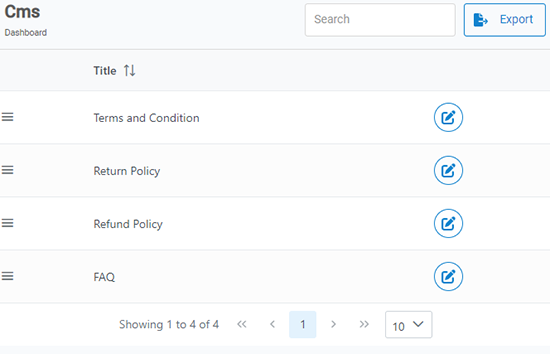
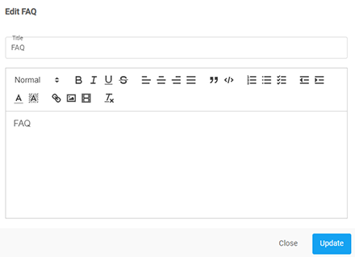

[Home](https://biijuwa.github.io/eckb/) / CMS
{: .fs-2 }

## Update a CMS

Follow these steps to update a cms title.

1. From the **Dashboard**, select **CMS.**

   

2. **Cms** page opens up. Search for the desired **_Cms_** and click on the  located at the right on the same row.

   

3. **Edit** dialog box opens up, and edit the information in the required field.

   

   > **Note:** Here we are updating the **_FAQ_.**

4. After completion, click on **Update.**

<a href="#top" id="back-to-top">Back to top</a>

---
