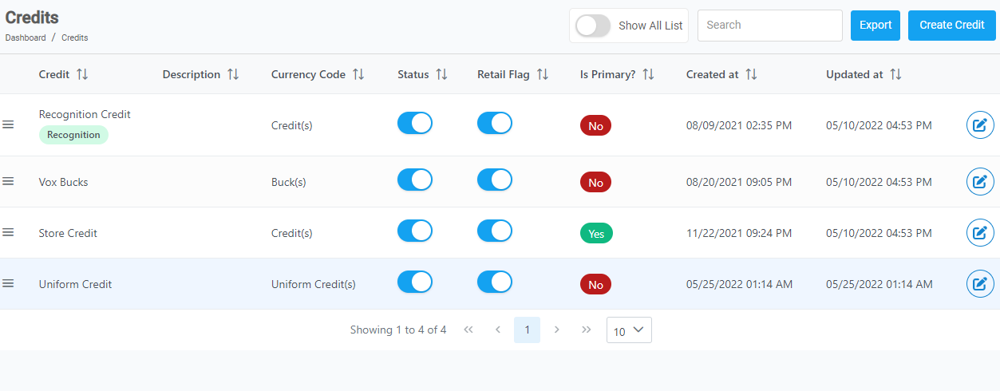
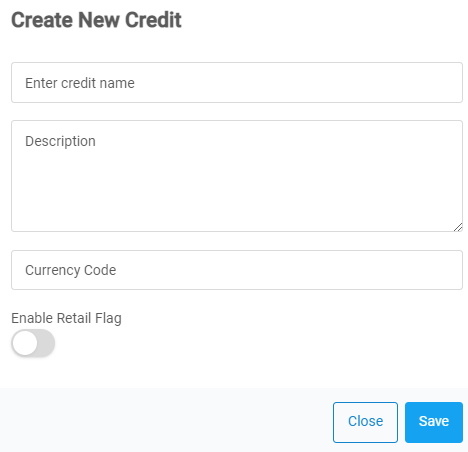

[Home](https://biijuwa.github.io/eckb/) /[Credits](https://biijuwa.github.io/eckb/docs/credits/credits.html) / Create Credit
{: .fs-2 }

---

### Steps to create a credit

1. From the **Dashboard**, select **Credits.**

   

2. Click on **Credits.**

   

3. Click on **Create Credit.**
4. **Create New Credit** dialog opens up, enter the required details in each field.

   

5. **[OPTIONAL]** Toggle **ON** the **Enable Retail Flag** option.

   > **Q.** What is the Retail Enable Flag for?
   > Retail Enable Flag is used when you ca

6. Click on the **Save Credit.**

<a href="#top" id="back-to-top">Back to top</a>

---
