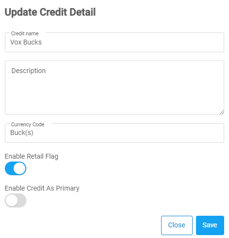

### Steps to edit a credit

1. From the **Dashboard**, select **Credits.**

   

2. Click on **Credits.**
3. **Credits** page opens up. You can directly interact with the **Status** and **Retail Falg** column to change the status of the desired credit.

   

4. To change the **Status**, click on the **Toggle Button** of the desired credit from the status column. Or, else skip to next step.
5. To change the **Retail Flag** status, click on the **Toggle Button** of the desired credit from the retail flag column. Or, else skip to next step.

   > **Note:**  indicates **Disabled** and  indicates **Enabled.**

6. Scroll down or use the searchbar to look for the desired credit. After you have found the desired **credit**, click on  located on the right side of the row.

7. **Update Credit Detail** dialog opens up, edit only the required fields.

   

8. **[OPTIONAL]** Toggle the **Retail Flag** to **ON** or **OFF** to **Enable** or **Disable Retail Flag** option.
9. **[OPTIONAL]** Toggle the **Enable Credit As Primary** to **ON** or **OFF** to **SET** or **UNSET** the credit as primary.
10. Click on the **Save**.

## <a href="#top" id="back-to-top">Back to top</a>
