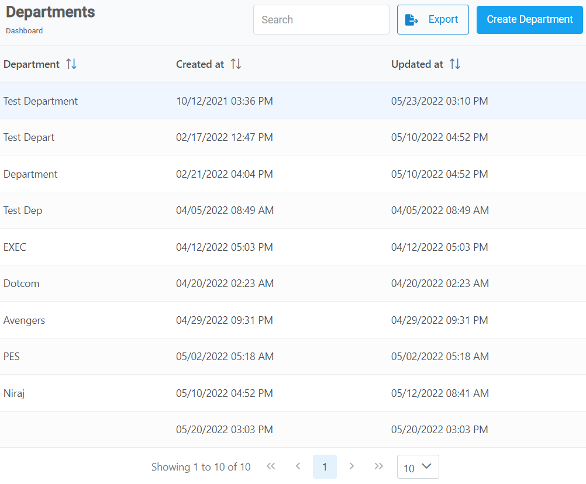
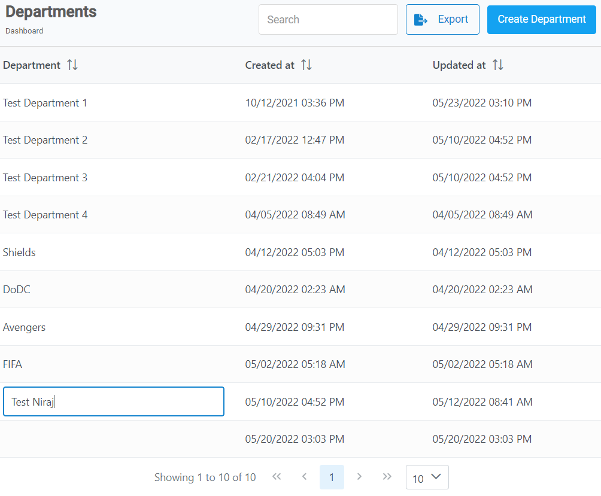

**Departments**

---

Every business be it small or large consists of departments. Department simply is a unit that deals with a specific area of function. All the departments work together to achieve the ultimate goal of the prosperity of a business.
{: .fw-400 .text-left}

This article is designed to help you create a new department and change the name of the existing department.
{: .fw-400 .text-left}

---

  

    <b>Topics covered in this article:</b>
  

  {: .text-delta }
* TOC
{:toc}

---

### Create a Department

Follow the steps to create a department.  

1. From the **Dashboard**, select **Departments.**

   

2. Click on **Create Department** button located on the top right corner.

   

3. **Create New Department** dialog box opens up, enter the required information in each field.

   

4. Click on **Save New Department.**

<a href="#top" id="back-to-top">Back to top</a>

---

### Edit a Department

Follow the steps to edit the name of a department. 

1. From the **Dashboard**, select **Departments.**

2. **Departments** page opens up. Search and then click on the desired **_Department name._**

3. A text box appears. Delete and enter a new **_department name._**

   

   > **Note:** As an example we will edit **_Test Niraj_** department.

<a href="#top" id="back-to-top">Back to top</a>

---
