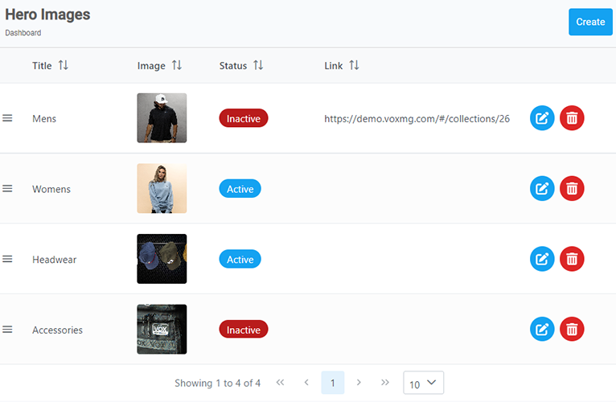
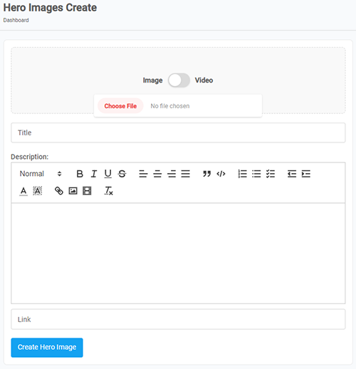
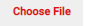
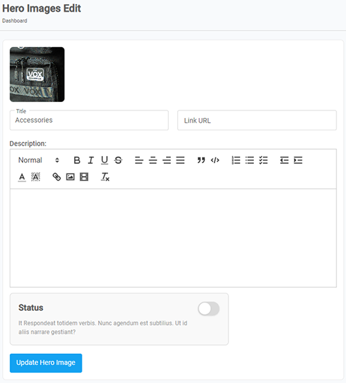

[Home](https://biijuwa.github.io/eckb/) / Hero Images
{: .fs-2 }

---

Getting clicked with a product on the very first sight is heavenly. Don’t you agree?
It is the mesmerizing product image that must have triggered the connection. Don’t you think?
{: .fh-default .text-left .fs-4 }
A hero image in our case is that mesmerizing product image that reels a customer in.
Capturing the visitor’s attention and maintaining engagement is what a hero image is best at.
{: .fh-default .text-left .fs-4 }
In this article we will go over the steps for creating, editing, and deleting a hero image.

  

    <b>In this article.</b>
  

  {: .text-delta }
* TOC
{:toc}

## Create a Hero Image

{: .my-4 .pb-2 }

Follow the steps to create a hero image.

1.  From the **Dashboard**, select **Hero Images.**

    

2.  **Hero Images** page opens up. Click on the **Create** button located on the top right corner.

    

3.  **Hero Images Create** page opens up. Scroll down to the sections and enter the required information in each field.

    

    - In the **Image Upload** section, click on the  and select the appropriate image from your device.
    - In the **Title** section, enter a title for the hero image.
    - In the **Description** section, type in a some combination of words and sentences that best describe the image.
    - In the **Link** section, enter a **URL** that the image redirects to.

4.  Click on the **Create Hero Image**.

<a href="#top" id="back-to-top">Back to top</a>

---

## Delete a Hero Image

{: .my-4 .pb-2 }

Follow the steps to Delete a hero image.

1. From the **Dashboard**, select **Hero Images.**

2. **Hero Images** page opens up, search for the appropriate image. When found, click on  located on the right.

   

3. **Confirmation** dialog box opens up, click on **Yes** to confirm.

<a href="#top" id="back-to-top">Back to top</a>

---

## Edit a Hero Image

{: .mb-lg-4 .pb-2 }

> **Important:** 
> A hero image cannot be deleted. It's information can be changed though.

Follow the steps to edit a hero image.

1. From the **Dashboard**, select **Hero Images.**

2. **Hero Images** page opens up, search for the appropriate image. When found, click on the  located on the right.

   

3. **Hero Images Edit** page opens up, edit the required information in each field.

   

4. **[Optional]** Click to toggle the status to **ON** to set the hero image to **Active** or **OFF** to set it to **Inactive.**
5. After you are done, click on **Upate Hero Image.**

<a href="#top" id="back-to-top">Back to top</a>

---
