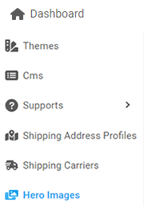
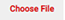

Getting clicked with a product on the very first sight is heavenly. Don’t you agree?
It was the enticing product image that triggered the connection. Don’t you think?

A hero image is the main product image that reels any of the customer in. Capturing the visitor’s attention and maintaining engagement is what a hero image is best at.

In this article we will understand the streps of creating a hero image, editing, and deleting.

---

  

    <b>Table of contents</b>
  

  {: .text-delta }
1. TOC
{:toc}

---

## Create a Hero Image

Follow the steps to create a hero image.

1. From the **Dashboard**, select **Hero Images.**

   

2. **Hero Images** page opens up. Click on the **Create** button located on the top right corner.

   

3. **Hero Images Create** page opens up. Scroll down to the sections and enter the required information in each field.

   

   - In the **Image Upload** section, click on the  and select the appropriate image from your device.
   - In the **Title** section, enter a title for the hero image.
   - In the **Description** section, type in a some combination of words and sentences that best describe the image.
   - In the **Link** section, enter a **URL** that the image redirects to.

4. Click on the **Create Hero Image**.

---

## Edit a Hero Image

> **Important:** 
> A hero image cannot be replaced, so the only option is to delete it, but no need to fear you can edit other information.

Follow the steps to edit a hero image.

1. From the **Dashboard**, select **Hero Images.**

2. **Hero Images** page opens up, search for the appropriate image. When an appropriate image is found, click on the  located on the right.

   

3. **Hero Images Edit** page opens up, edit the required information in each field.

   

4. **[Optional]** Click to toggle the status to **ON** to set the hero image to **Active** or **OFF** to set it to **Inactive.**
5. After you are done, click on **Upate Hero Image.**

---

## Delete a Hero Image

Follow the steps to Delete a hero image.

1. From the **Dashboard**, select **Hero Images.**

2. **Hero Images** page opens up, search for the appropriate image. When found, click on  located on the right.

   

3. **Confirmation** dialog box opens up, click on **Yes** to confirm.

---
