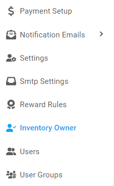
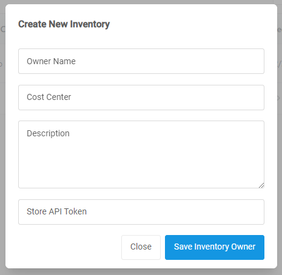
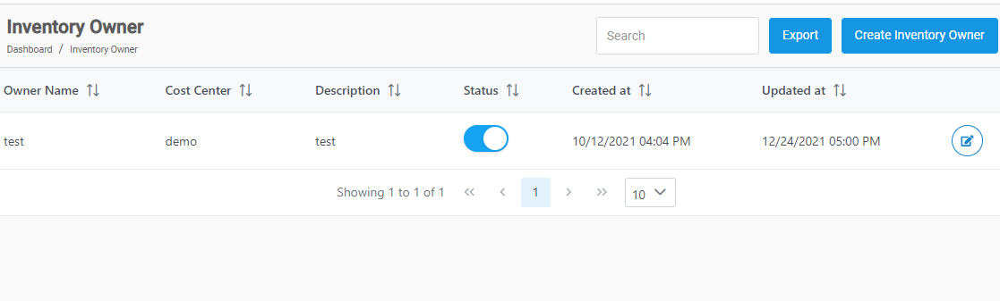
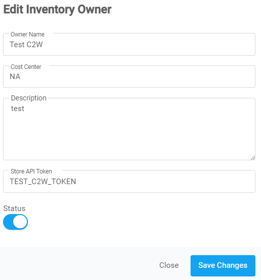

[Home](https://biijuwa.github.io/eckb/) / Inventory Owner
{: .fs-2 }

##

  

    <b>On this page</b>
  

  {: .text-delta }
1. TOC
{:toc}

---

### Create an Inventory Owner

Follow the steps to create an inventory owner.

1. From the **Dashboard**, select **Inventory Owner.**
   {: .fh-default }

   
   {: .fh-default }

2. **Inventory Owner** page opens up, click on the <button class="btn disabled">
   Create Inventory Owner </button> located on the top right corner.

3. **Create New Inventory** dialog opens up, enter the required details in each field.

   

   - **Owner Name:** The name of the inventory's owner.
   - **Cost Center:** The name of the cost center.
   - **Description:** Combination of words to describe the invnetory.
   - **Store API Token:** API token of your store.

4. Click on **Create Inventory Owner.**

<a href="#top" id="back-to-top">Back to top</a>

---

### Edit an inventory owner

Follow the steps to edit an inventory owner.

1. From the **Dashboard**, select **Inventory Owner.**

2. **Inventory Owner** page opens up. You can directly change the status of the any desired inventory owner to either **Active** or **Inactive**.

   

3. To change the **Status**, click on the **Toggle button** of the desired inventory owner from the status column. Or, else skip to next step.

4. Search for the desired owner name. When found, click on the  located on the far right on same row.
5. **Edit Inventory Owner** dialog opens up, edit the information in required fields.

   

6. When you are done with changes, click on the **Save Changes** button.

<a href="#top" id="back-to-top">Back to top</a>

---
