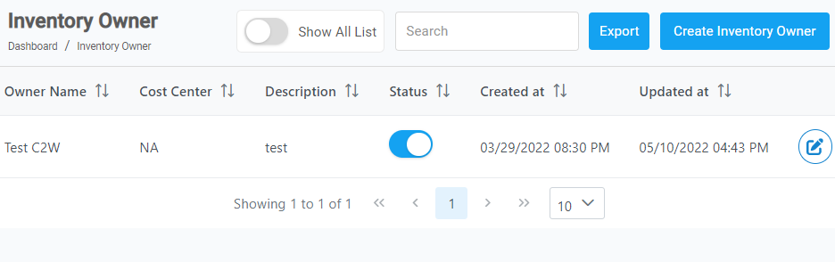
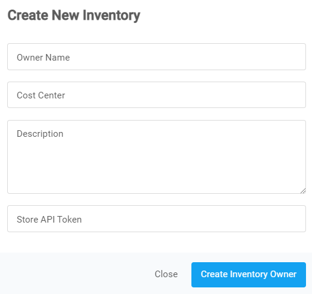

##

---

### Steps to create an Inventory Owner

1. From the **Dashboard**, select **Inventory Owner.**

   

2. **Inventory Owner** page opens up, click on the **Create Inventory Owner** located on the top right corner.

   

3. **Create New Inventory** dialog box opens up, enter the required details in each field.

   

   - **Owner Name:** The name of the inventory's owner.
   - **Cost Center:** The name of the cost center.
   - **Description:** Combination of words to describe the invnetory.
   - **Store API Token:** API token of your store.

4. Click on **Create Inventory Owner.**
