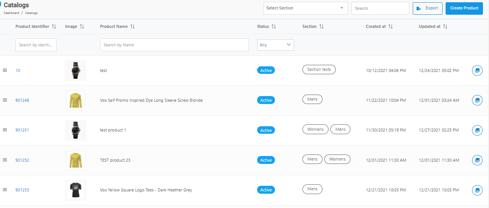
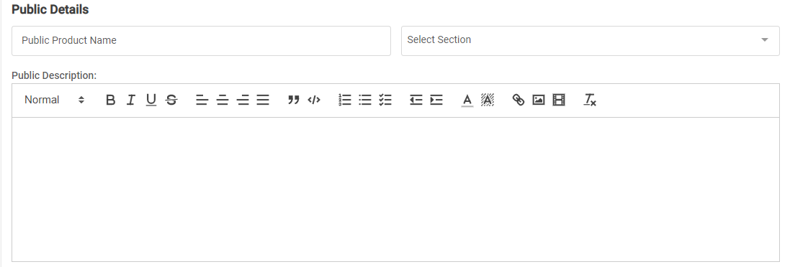
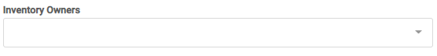
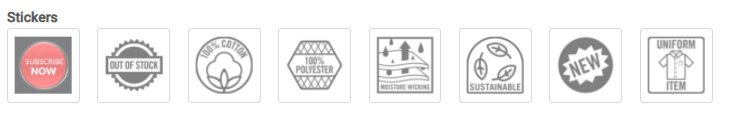
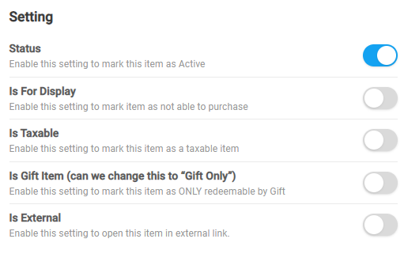
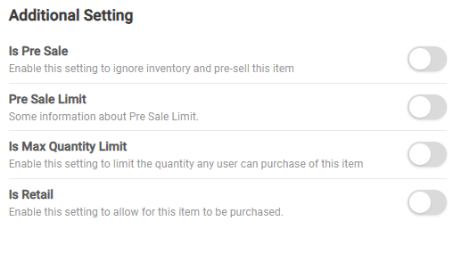
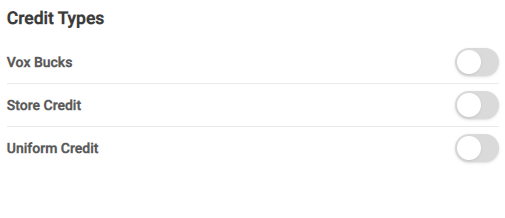
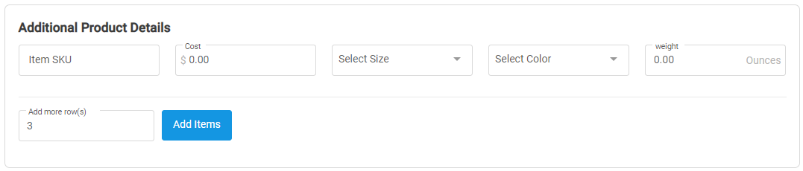

[Home](https://biijuwa.github.io/eckb/) / [Catalogs](https://biijuwa.github.io/eckb/docs/manageproducts/catalogs/catalogs.html) / Create a Product
{: .fs-2 }

---

### Steps to create a product

1. From the **Dashboard**, select **Manage Products.**

   

2. Click **Catalogs.**

3. On the **Catalogs** page, click **Create Product.**

   

4. In the **Vox Product Details** section, enter a name for the product.

   

5. In the **Public Details** section, enter the required information in each field.

   

   - **Public Details:** Enter a public name for the product.
   - **Select Section:** Select a section from the drop-down.
   - **Public Description:** Type in a description about the product.

   > _Note_: You can select multiple sections as required.

6. In the **Inventory Owners** section, select an owner from the drop-down.

   

7. Click on the **Sticker** icon to select a sticker.

   

   > _Tip_: A blue border appears around the sticker you have selected.
   > You can also select multiple stickers.

8. From the **Setting** section, toggle the individual setting to either **ON** or **OFF**.

   

9. From the **Additional Setting** section, toggle the individual setting to either **ON** or **OFF**.

   

10. From the **Credit Types** section, toggle the individual setting to either **ON** or **OFF**.

    

11. In the **Additional Product Details** section, enter the required information in each field.

    

    - **Item SKU:** Enter the SKU of the product.
    - **Cost:** Enter the cost of the product.
    - **Select Size:** Select the size form the drop down.
    - **Select Color:** Select the color from th drop down.
    - **Weight:** Enter the weight of the product.

    > _Tips:_  
    > If you want to add more products, click on the **Add Items**. System will generate additional 3 input fields for you. You can change the value from 3 to desired one.

12. **[Optional]** Toggle the **Add To Catalog Queue** to **ON** and add a note in the text field.

    > _Important:_  
    > Use this option only if you don't have enough details (materials) for creating a product. It works as a savepoint. You can continue the process from **Catalogs Queues.**

13. Click on **Save Catalog** button to complete.

<a href="#top" id="back-to-top">Back to top</a>

---
