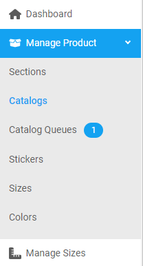
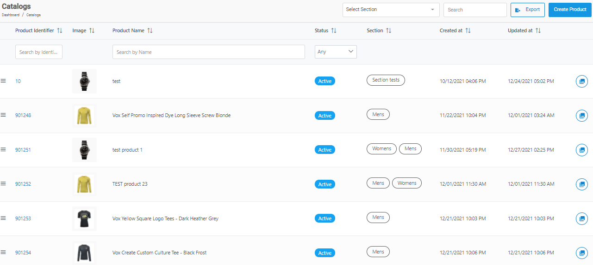
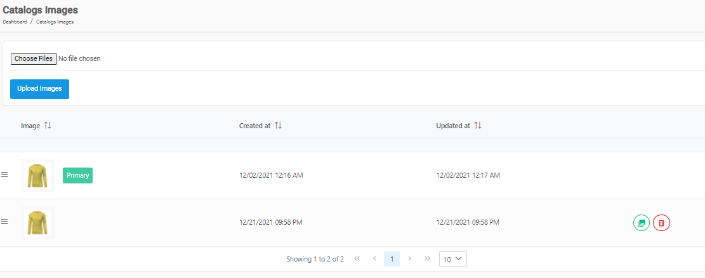
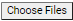

[Home](https://biijuwa.github.io/eckb/) / [Catalogs](https://biijuwa.github.io/eckb/docs/manageproducts/catalogs/catalogs.html) / Manage Images
{: .fs-2 }

---

### Steps to create a product

1. From the **Dashboard**, select **Manage Products.**

   

2. Click **Catalogs.**
3. **Catalogs** page opens up, you can either scroll down the list or use **Searchbar** to search for the appropriate product. When found click on the  icon located on the far right.

   

   > _Tips:_ If the displayed list contains many products I suggest you to use **Searchbar** which is quick and easy rather than frantically scrolling down.

4. **Catalog Images** page opens up, you can perform following actions.

   

   - **Upload a New Image**
   - **Set an Image as Primary**
   - **Delete an Image**

   #### **Upload a New Image**

   - Click on the  button.
   - Select an image from your device.
   - Click on the **Upload Images** button.

   #### **Set an Image as Primary**

   - Scroll down the list to select an appropriate image.
   - Click on the 
   - Click on the **Yes** button to confirm.

   #### **Delete an Image**

   - Scroll down the list to search for an appropriate image.
   - Click on the 
   - Click on the **Yes** button to confirm.

<a href="#top" id="back-to-top">Back to top</a>

---
