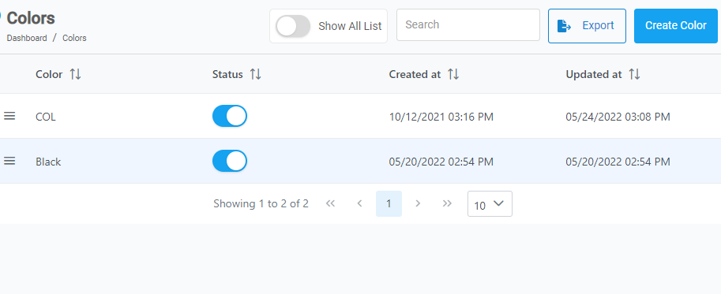

[Home](https://biijuwa.github.io/eckb/) / [Colors](https://biijuwa.github.io/eckb/docs/manageproducts/colors/colors.html) / Create a Color
{: .fs-2 }

---

### Steps to create a color

1. From the **Dashboard**, select **Manage Products.**

   

2. Select **Colors.**

3. Click on the 

   

4. **Create New Color** dialog box opens up, enter the name for the color.

   

5. Click on the **Save New Color**.

<a href="#top" id="back-to-top">Back to top</a>

---
