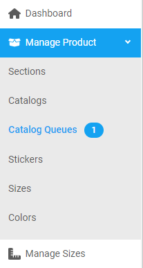
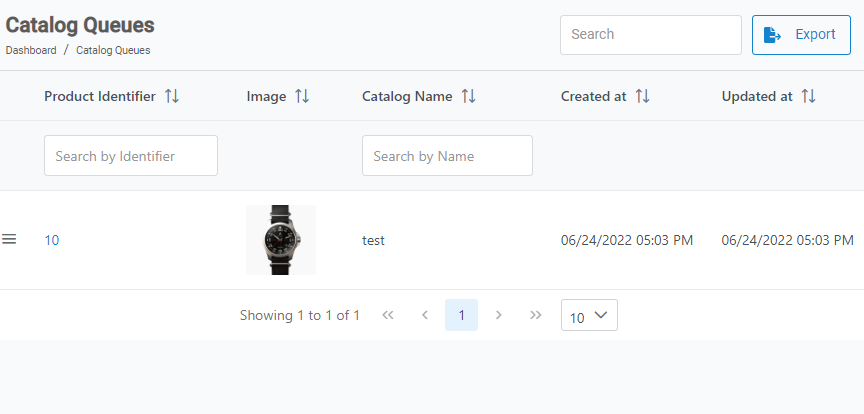

[Home](https://biijuwa.github.io/eckb/) / [Catalog Queues](https://biijuwa.github.io/eckb/docs/manageproducts/cqueues/cqueues.html) / Continue Catalog Creation
{: .fs-2 }

---

###

1. From the **Dashboard**, select **Manage Products.**

   

   > **Note:** The number you see next to **Catalog Queues** represents the number of saved catalogs.

2. Select **Catalog Queues**

3. Scroll down the list or use the _Searchbar_ to search for the appropriate catalog. When found click on the **Product Identifier** number.

   

   > _Note:_ The searchbar uses two different criteria. You can either use the **producr identifier** or **catalog name** searchbar.

4. **Catalog Details** page opens up. Scroll down to the fields that needs to be edited. Check and edit the data.

5. Toggle OFF the **Add To Catalog Queue** option.

   > **IMPORTANT**:
   > The **Add To Catalog Queue** is only enabled when the catalog being created is missing of the vital data. Instead of publishing a catalog with incomplete details it is added to the **Catalog Queue** section.

6. Click on the **Save Changes**.
