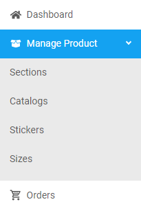

### Steps to create a section

1. From the **Dashboard**, select **Manage Products.**
   
   

2. Click **Sections.**

3. On the **Sections** page, click **Create New Section.**

    
   
4. **Create New Section** dialog box opens up, enter the required information in each field.

    
   
    * **Section name:** Enter a name for the new section. 
    * **Select member roles:** Select the desired member roles from the drop down

>*Note:* You can select mulitple roles from the drop down. 

5. Click on the Save button. 

FRANK

