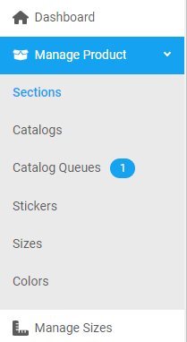
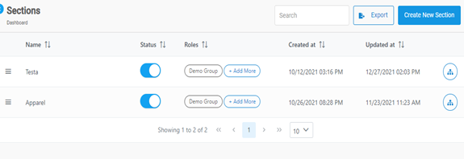
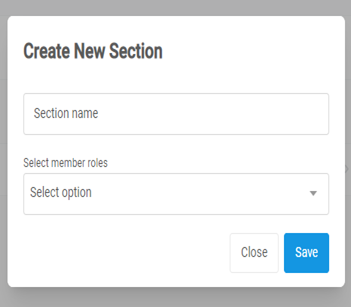

[Home](https://biijuwa.github.io/eckb/) / [Sections](https://biijuwa.github.io/eckb/docs/manageproducts/sections/sections.html) / Create Section
{: .fs-2 }

### Steps to create a section

1. From the **Dashboard**, select **Manage Products.**

   

2. Click **Sections.**

3. On the **Sections** page, click **Create New Section.**

   

4. **Create New Section** dialog box opens up, enter the required information in each field.

   

   - **Section name:** Enter a name for the new section. 
   - **Select member roles:** Select the desired member roles from the drop down

   > _Note:_ You can select mulitple roles from the drop down.

5. Click on the **Save** button.

<a href="#top" id="back-to-top">Back to top</a>

---
