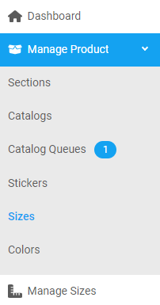
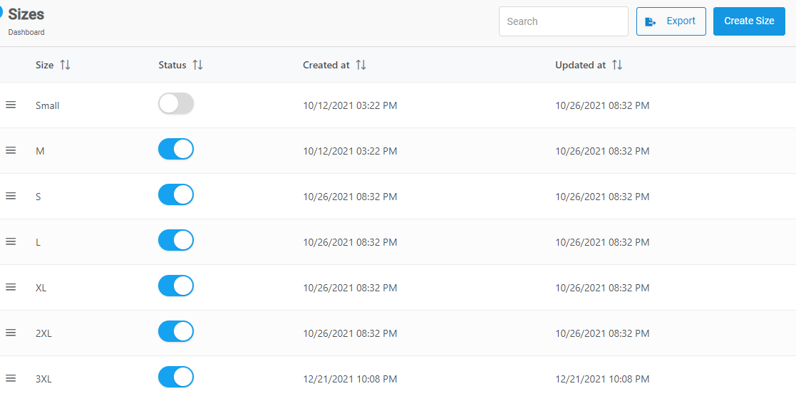
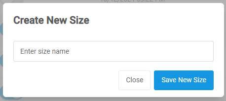

### Steps to create a size

1. From the **Dashboard**, select **Manage Products.**

   

2. Select **Sizes.**

   

   > _Note:_

3. **Create New Size** dialog box opens up, enter the name for the new size.

   

4. Click on the **Save New Size** button.

---
