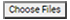

[Home](https://biijuwa.github.io/eckb/) / [Stickers](https://biijuwa.github.io/eckb/docs/manageproducts/stickers/stickers.html) / Create a Sticker
{: .fs-2 }

---

#### Steps to create a sticker

1. From the **Dashboard**, select **Sticker.**

   

2. Select **Stickers.**
3. Click on the  located on the top right corner.
4. Click on the 

   

5. Click on the .
