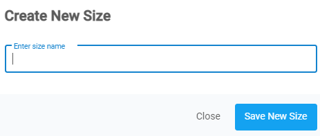

[Home](https://biijuwa.github.io/eckb/) / Manage Sizes
{: .fs-2 }

<b> Introduction </b>

---

  

    <b>In this article.</b>
  

  {: .text-delta }
* TOC
{:toc}

---

## Create a new size category

To create a new size category follow these steps.

1. From the **Dashboard,** select **Manage Sizes.**

   

2. Click on  located on the top right corner.

   

3. **Create New Size** dialog box opens up, enter the _name_ for the size.

   

4. Click on **Save New Size.**

<a href="#top" id="back-to-top">Back to top</a>

---

## Create a new sizes for a category.

1. From the **Dashboard,** select **Manage Sizes.**
2. **Manage Size Category** page opens up. Search for the desired _*category*_ and then click on  located at the right on the same row.

   

3. **Manage sizes** page opens up. Click on  located on the top right corner.

   

4. **Create New Size** dialog box opens up, enter a name for the size.

   

5. Click **Save New Size** to complete.

<a href="#top" id="back-to-top">Back to top</a>

---
