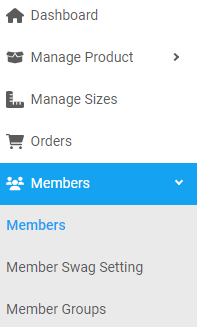
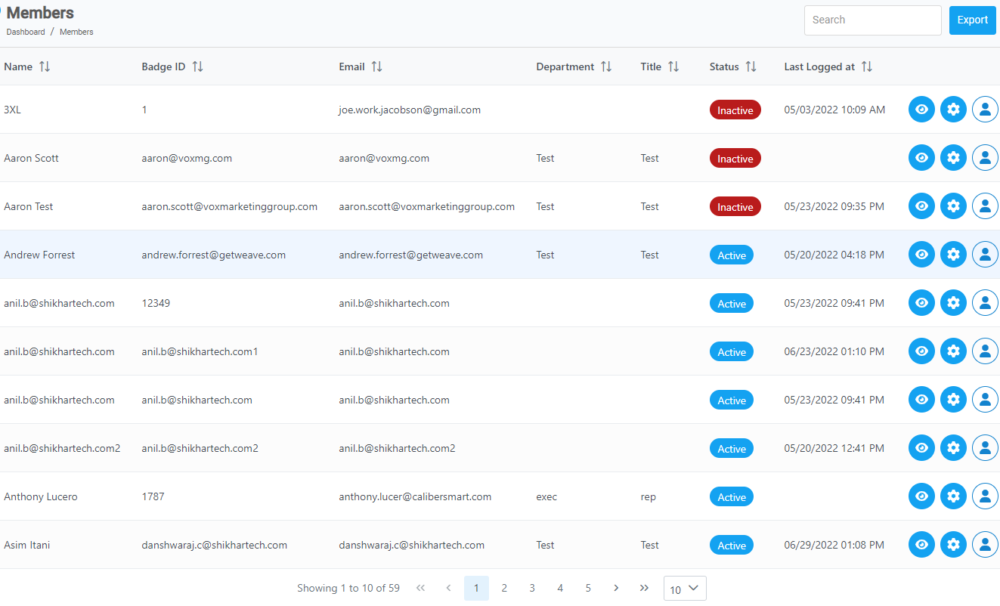
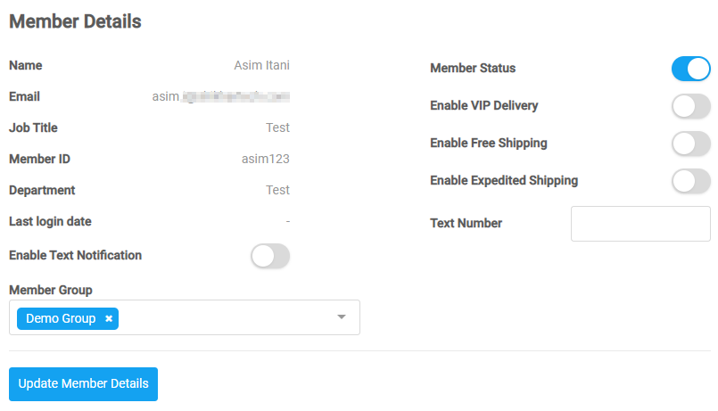
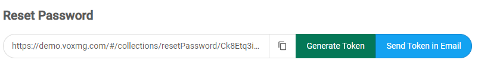

[Members](https://biijuwa.github.io/eckb/docs/members/members.html) / Members

---

### Edit a member

---

1. From the **Dashboard**, select **Members.**

   

2. Click on **Members.**
3. **Members** page opens up. Search for the desired _member_.

   

4. Click on the  located on the right on the same row as your desired member.

5. On the **Member Details** section, click on the <b> _toggle button_ </b> to set the required settings to **active.**

   

6. To <b> _add_ </b> a text number, click on the <b> _text number_ </b> field, and enter a valid phone number.
7. To <b> _assign_</b> member group, click on the <b> _Member Group_ </b> field, and select from the drop down menu.

8. When you are done, click on **Update Member Details.**

---

### Reset password

## Text

1. On the **Member Details** page, scroll down to the <b> _Reset Password_ </b> section.

   

2. Click on the **Send Token in Email** button.

   An email with a passowrd reset **URL** will be sent to the member.

   > **Q. Why is the URL in the email is not working?**  
   > -> The URL sent in the email has expired. The password reset URL has an expiry period.
   > If you try to access it after the expiry period, it no longer works.

   {: .text-left}
