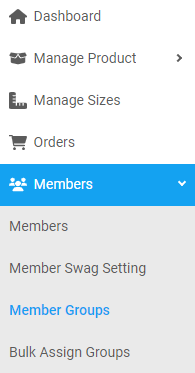
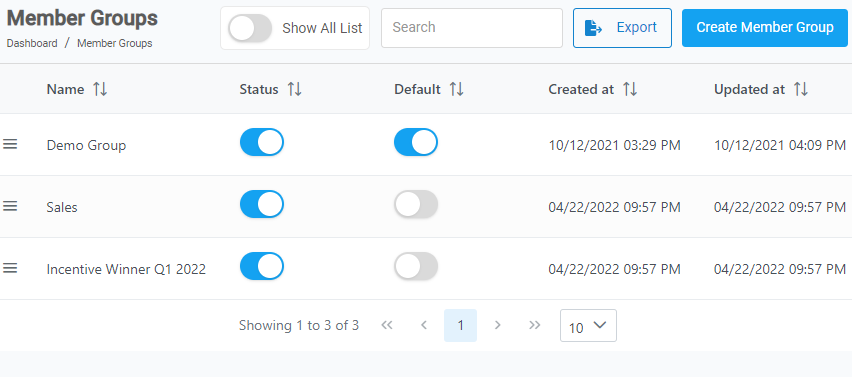
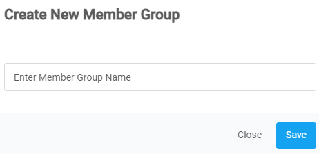

[Members](https://biijuwa.github.io/eckb/docs/members/members.html) / Member Groups

---

### Create a member group

{: .fw-700 }

Text

---

1. From the **Dashboard**, select **Members.**

   

2. Click on **Create Member Group** button located on the top right corner.

   

3. **Create New Member Group** dialog opens up, enter the member group name in the text field.

   

4. Click on **Save.**

---

### Change the status of a group member

{: .fw-700 }

text

---

1. From the **Dashboard**, select **Group Members.**
2. On the **Member Group** page, click on the **Show All list.**

   By default, only the **active group members** get displayed. Now you will be able to see the **inactive group members** as well.

   {: .lh-tight .text-left }

3. Search for the desired group member. When found click on the <b> _Status_ </b> toggle button next to it.

   > **Tip:**

---

### Set a member group as default

{: .fw-700 }

text

---

> **Important:**   Only one **Member Group** can be set as a default at once.

1. From the **Dashboard**, select **Group Members.**
2. **Member Groups** page opens up, search for the desired group member. When found click on the <b> _Default_ </b> toggle button next to it.

---
