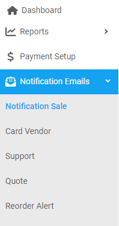

## (intro)

---

### Create a notification sale email

---

1. From the **Dashboard**, select **Notification Emails.**

   

2. Click on **Notification Sale.**
3. **Notification Sale** page opens up, click on the  located on the top right corner.
4. **Create Notification Email** dialog opens up, enter the notification email you want to add.
5. Click on **Save.**

---

### Remove a notification sale email

---

1. From the **Dashboard**, select **Notification Emails.**

2. Click on **Notification Sale.**
3. **Notification Sale** page opens up, search for the email you want to remove.

   

4. When found, click on the  located on the right of the same row.

5. **Delete Notification Email** dialog opens up, click on the **Yes.**

---
