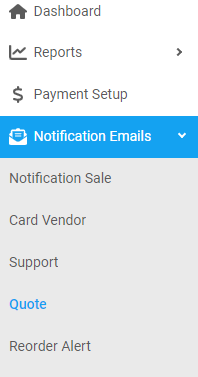

## Intro

---

### Create a quote email

---

1. From the **Dashboard**, select **Notification Emails.**

   

2. Click on **Quote.**
3. **Quote** page opens up, click on the  located on the top right corner.
4. **Create Notification Email** dialog opens up, enter the notification email you want to add.

   

5. Click on **Save.**

<a href="#top" id="back-to-top">Back to top</a>

---

### Delete a quote email

---

1. From the **Dashboard**, select **Notification Emails.**
2. Click on **Quote.**
3. **Quote** page opens up, search for the email you want to remove.

   

4. When found, click on the  located on the right of the same row.

5. **Delete Notification Email** dialog opens up, click on the **Yes.**

<a href="#top" id="back-to-top">Back to top</a>

---
