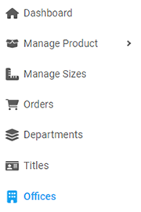
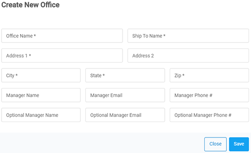
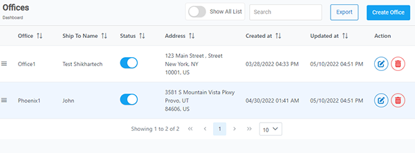
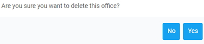

INTRO

---

  

    <b>In this article.</b>
  

  {: .text-delta }
* TOC
{:toc}

---

## Create an office

Follow these steps to create an office.

1. From the **Dashboard,** select **Offices.**

   

2. Click on  located on the top right.
3. **Create New Office** dialog box opens up, enter the required information in each field.

   

   > **Note:** Fields with '\*' cannot be left blank.

4. After you complete, click on **Save.**

<a href="#top" id="back-to-top">Back to top</a>

---

## Delete an office

Follow these steps to delete an office.

1. From the **Dashboard,** select **Offices.**

2. **Offices** page opens up. Search for desired **_Office name_**, and then click on  located at the right on the same row.

   

3. **Delete** confirmation dialog box opens up, click on **Yes.**

   

<a href="#top" id="back-to-top">Back to top</a>

---

## Edit an office

Follow these steps to edit an office.

1. From the **Dashboard,** select **Offices.**

2. **Offices** page opens up. Search for desired **_Office name_**, and then click on  located at the right on the same row.

   

   > **Note:** As an example, we will be editing **_Office 1._**

3. **Update Office** dialog box opens up, edit the information in the required fields.

4. After you are done, click on **Save.**

<a href="#top" id="back-to-top">Back to top</a>

---
