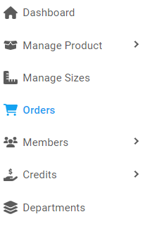
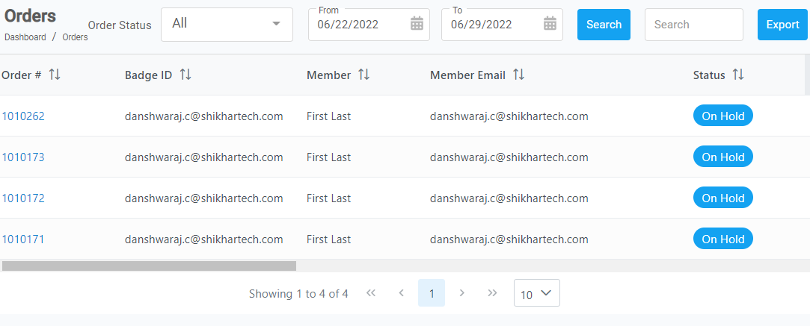
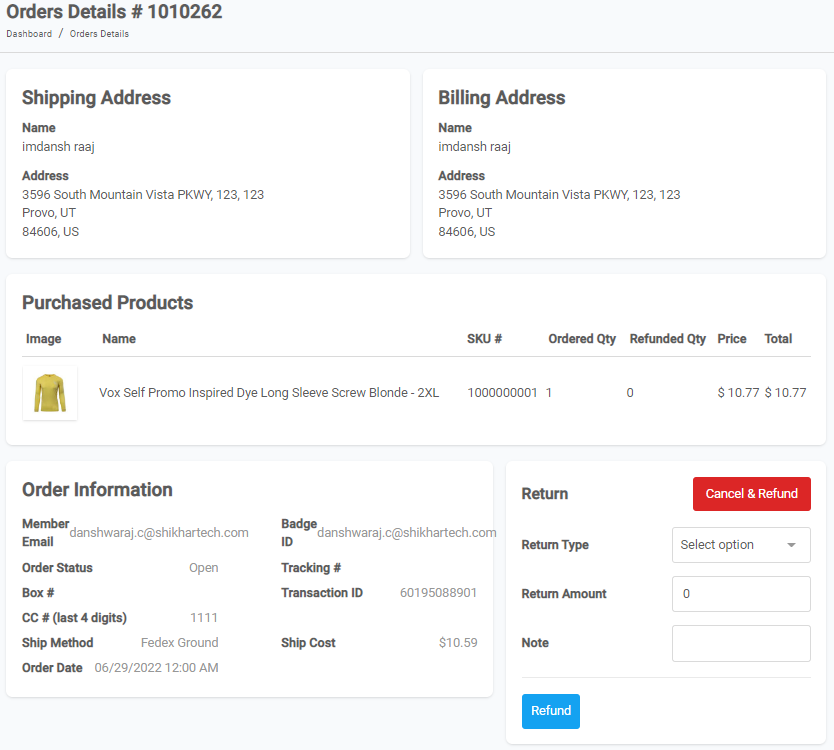

[Home](https://biijuwa.github.io/eckb/) / Orders
{: .fs-2 }

  

    <b>On this page</b>
  

  {: .text-delta }
1. TOC
{:toc}

---

### Steps to cancel/refund an order

1. From the **Dashboard**, select **Orders.**

   

2. **Orders** page opens up. Either use **Searchbar** or **Scroll** through the list to search for the appropriate order.

   

3.When you find your desired order, click on its **order number** from the order column.

4. **Orders Details #** page opens up, scroll down to the bottom.  `Here order number 1010262 is used as an example.`

   

5. To cancel

<a href="#top" id="back-to-top">Back to top</a>

---
