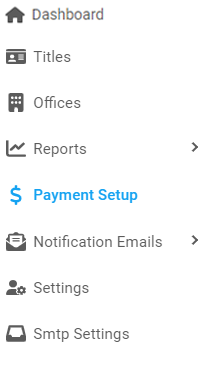

[Home](https://biijuwa.github.io/eckb/) / Payment Setup
{: .fs-2 }

## payment

---

### How to edit a Payment Setup

1. From the **Dashboard**, select **Payment Setup.**

   

2. **Payment Setup** page opens up. Click on  located on the right.

3.
