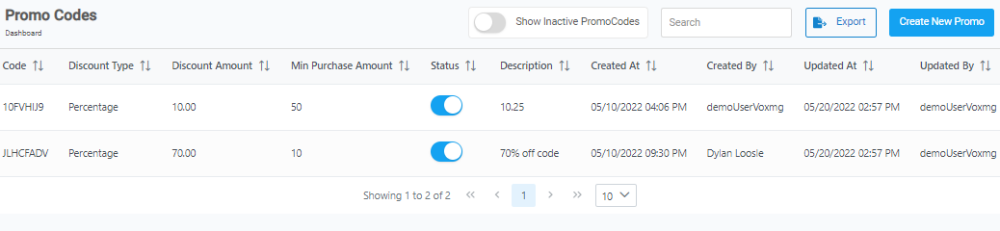

[Home](https://biijuwa.github.io/eckb/) / Promo Code
{: .fs-2 }

<b>Intro</b>

---

### Create a new promo code

{: .my-4 .pb-2 }

1. From the **Dashboard,** select **Promo Codes.**

   

2. Click on  located in the top right corner.
3. **Create New Promo** dialog box opens up, enter the required information in each field.

   

4. **[Optional]** Click on  to change its status to **_Deactive._**
5. After you are done, click on **Save** or else skip it.

<a href="#top" id="back-to-top">Back to top</a>

---

### Activate or Deactivate a promo code

{: .my-4 .pb-2 }

1. From the **Dashboard,** select **Promo Codes.**
2. **Promo Codes** page opens up, search for desired **_promo code_** from the given list.

   

   > **Note:**  
   > The list will not contain the promo codes that are deactivated In order to view the inactive codes, click on  to turn on the option.

3. When found click on toggle button located under the **_Status_** column.

<a href="#top" id="back-to-top">Back to top</a>

---
