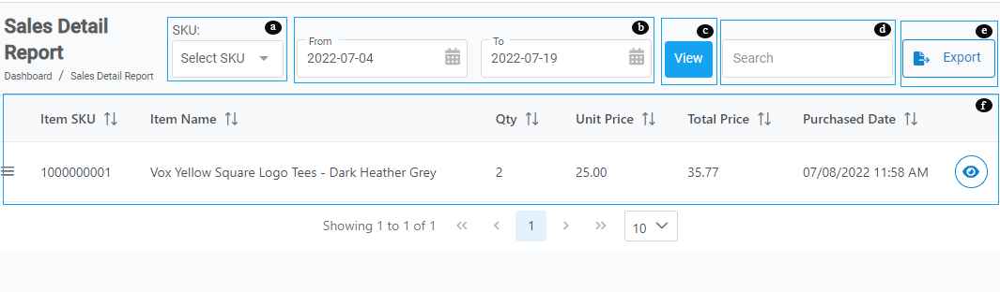
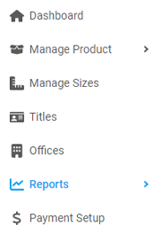
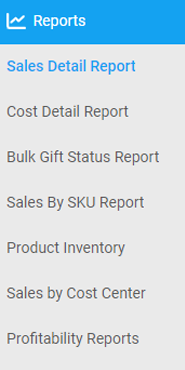

<b> INTRO </b>

---

  

    <b>In this article.</b>
  

  {: .text-delta }
* TOC
{:toc}

---
   
**Understanding the Sales Detail Report page layout:**

   

   a. **Select SKU:** Select a particular SKU from the drop down.  
   b. **From / To:** Select the start date and end date. 
   c. **View:** Click to generate a report. 
   d. **Search bar:** Use to search for a report using name or SKU. 
   e. **Export:** Click to export a report. 
   f. **Report details pane:** Contains all the reports and their details. 

## View Sales Detail Report

Follow the steps to view a sales detail report.

1. From the **Dashboard,** select **Sales Detail Report.**

   

2. Click **Sales Detail Report.**

   

3. **Sales Detail Report** page opens up.

  4. 
