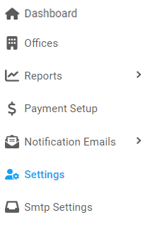

[Home](https://biijuwa.github.io/eckb/) / Settings
{: .fs-2 }

## Settings

---

## Before

### Understanding the column of the settings

- **Name:** The column contains the name given to a particular email setting.
- **Mail Name:** The column contains the value assigned to a particular email setting.
- **Comment:** The column contains information about a setting.
- **Updated at:** The column contains timestap when a setting was updated.

### Steps to edit the value of

1. From the **Dashboard**, select **Settings.**

   

2. **Settings** page opens up.
