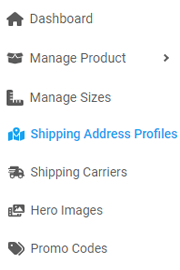
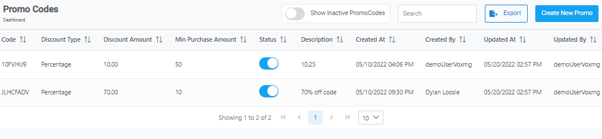
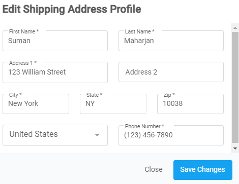

[Home](https://biijuwa.github.io/eckb/) / Shipping Address Profiles
{: .fs-2 }

<b>Intro</b>

---

  

    <b>In this article.</b>
  

  {: .text-delta }
* TOC
{:toc}

---

### Edit a shipping address profile

1.  From the **Dashboard,** select **Shipping Address Profiles.**

    

2.  Search for the desired profile, when found click  located under the **Action** column on the same row.

    

3.  **Edit Shipping Address Profile** dialog box opens up, edit the information in required fields.

    

4.  When done, click on **Save Changes.**

<a href="#top" id="back-to-top">Back to top</a>

---

### Delete a shipping address profile

1. From the **Dashboard,** select **Shipping Address Profiles.**
2. Search for the desired profile, when found click  located under the **Action** column on the same row.
3. **Confirmation** dialog box opens up, click on **Yes.**

   

<a href="#top" id="back-to-top">Back to top</a>

---
