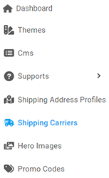
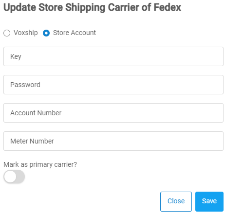

[Home](https://biijuwa.github.io/eckb/) / Shipping Carriers
{: .fs-2 }

---

A shipping carrier is a service company that handles the delivery of your product to the customer. It is crucial to choose the right shipping carrier but deciding on which carrier to opt for is always circumstantial. Each carrier provides its own set of services.Through our partnership program, we have integrated with major shipping carriers.
{: .fh-default .text-left .fs-4 }

In this article, you will be able to assign the most suitable carrier as your primary shipping carrier for all your deliveries.

---

## **Mark a shipping carrier as primary**

Follow these steps to mark a shipping carrier as primary.

> **Important:**  
> From all the listed carrier, you can only set one shipping carrier as your **Primary Carrier.**

1. From the **Dashboard**, select **Shipping Carriers.**

   

2. From the listed **Shipping Carriers**. Click the  located on the right on the same row as the carrier you want to make primary.

   

   > _Note:_  
   > Here **FedEx** is set as primary carrier.

3. If you have selected **Fedex** follow these steps or else you may skip.

   a. **Update Store Shipping Carrier of Fedex** dialog box opens up.

   

   b. **Voxship's** FedEx account is set as default account. Follow these steps to set your own **Store's** FedEx account or else skip it.

   - Click **Store Account** and enter the required information in each fields that appears.

     

   c. Click  to toggle **ON** located under **Mark as primary carrier?**

   d. After you are done, click on the **Save.**

4. If you have selected **USPS** follow the steps or else skip it.

   a. **Update Store Shipping Carrier of USPS** dialog box opens up.

   

   b. **Voxship's** USPS account is set as default account. Follow these steps to set your own **Store's** USPS account or else skip.

   - Click **Store Account** and enter a store token.

     

   c. Click  to toggle **ON** located under **Mark as primary carrier?**

   d. After you are done, click on the **Save.**

5. If you want to opt for **Flat Rate**, follow these steps.

   > **Understanding Flat Rate**
   > dasda

   a. **Update Store Shipping Carrier of Flate Rate** dialog opens up.

   b. Enter the **Flat Rate amount** to be charged for the shipping.

   c. Click to toggle **ON** the **Mark as primary carrier?**

   d. After you are done, click on the **Save.**

<a href="#top" id="back-to-top">Back to top</a>

---
