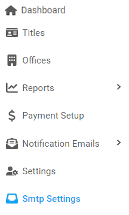

[Home](https://biijuwa.github.io/eckb/) / Smtp Settings
{: .fs-2 }

## SMTP Settings

---

### Steps to edit SMTP settings

1. From the **Dashboard**, select **SMTP Settings.**

   

2. **SMTP Settings** page opens up. Search for the desired **SMTP Setting**. When found, click on  located on the right.

3. **Update Smtp Setting** dialog opens up. Edit the information only in th required fields.

   

4. When you are done, click on **Save.**

<a href="#top" id="back-to-top">Back to top</a>

---
