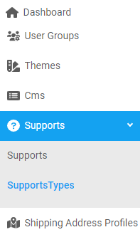
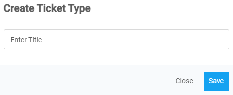
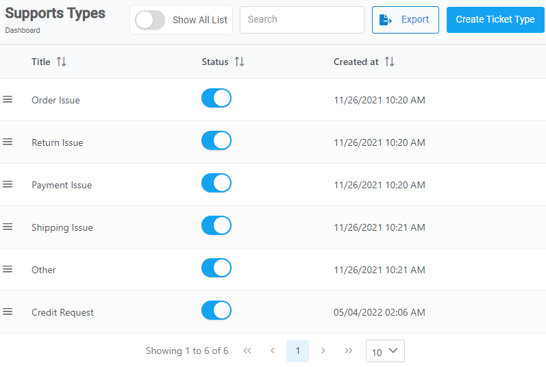
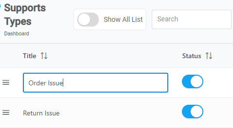

Intro

---

  

    <b>In this article.</b>
  

  {: .text-delta }
* TOC
{:toc}

---

<b> _Things to know_ </b>

- A **_Ticket Type_** cannot be deleted but its status can be change to **_inactive._**
-  means **Active** and  means **Inactive.**

---

## Create a Ticket Type

{: .my-4 .pb-2 }

Follow these steps to create a ticket type.

1. From the **Dashboard**, select **Supports.**

   

2. Click on **Supports Types.**

3. Click  located in the top right corner.

4. **Create Ticket Type** confirmation dialog box opens up. Type in the **_title name_** in the text field.

   

5. Click **Save** to confirm.

<a href="#top" id="back-to-top">Back to top</a>

---

## Rename a ticket type

{: .my-4 .pb-2 }

Follow the steps to change the ticket's title.

1. From the **Dashboard**, select **Supports.**
2. Click on **Supports Types.**
3. **Supports Types** page opens up. Click on the desired **_tile name_** from the **Title column.**

   

   > **Tip:** If you want to view both <b>_active_</b> and <b>_inactive_</b> ticket title click on **Show All List.**

4. Text field opens up. Enter a new **_title name_** and then press **Enter.**

   

   > **Note:** As an example we are renaming the title name for <b>_Order Issue._</b>

<a href="#top" id="back-to-top">Back to top</a>

---

## Change ticket type's status

{: .my-4 .pb-2 }

Follow the steps to change the ticket type's status.

1. From the **Dashboard**, select **Supports.**
2. Click on **Supports Types.**
3. **Supports Types** page opens up. Click on the desired **_tile name_** from the list.

   > **Important:** The list will not contain **_inactive_** titles so incase you want to change the status of an **_inactive_** title you have to turn **On** the **_Show All List_** option.

   

4. To change the status from <b>_Active_</b> to <b>_Inactive_</b>, click on  located on the right side of the desired title. Or else skip it.
5. To change the status from <b>_Inactive_</b> to <b> _Active_</b>, click on  located on the right side of the desired title.

<a href="#top" id="back-to-top">Back to top</a>

---
