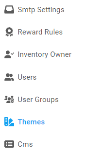

[Home](https://biijuwa.github.io/eckb/) / Themes
{: .fs-2 }

## Themes

---

### Steps to apply a theme

1. From the **Dashboard**, select **Themes**.

   

2. **Themes** page with all the available to use themes opens up, browse and select a theme.

   

3. To apply the selected theme, cli ck on the 
4. **Confirmation** dialog opens up, click on **Yes** to apply the theme.

<a href="#top" id="back-to-top">Back to top</a>

---

### Steps to Customize a theme
