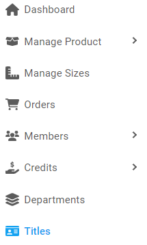
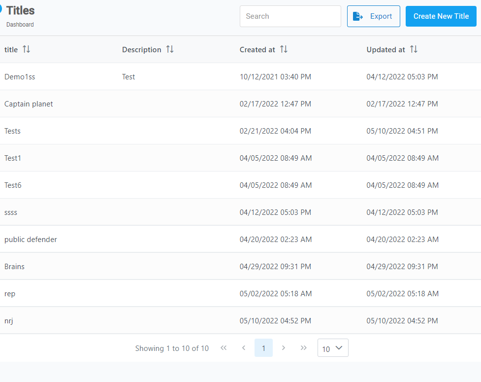
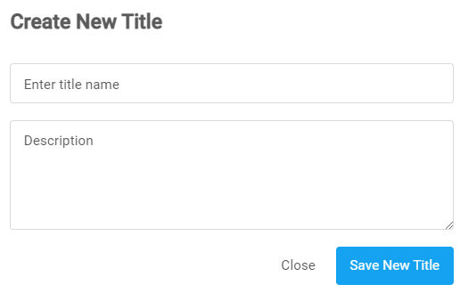
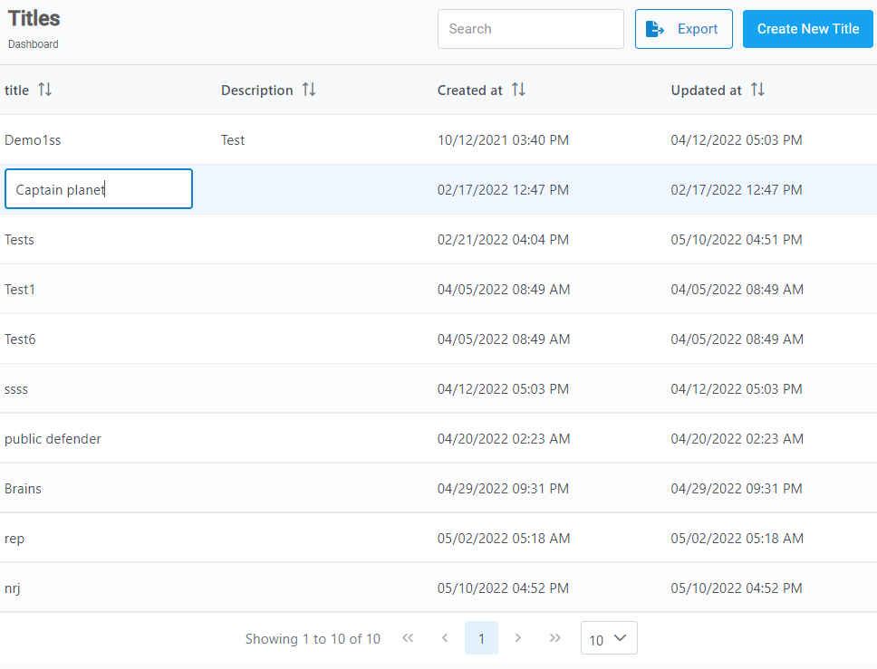

[Home](https://biijuwa.github.io/eckb/) / Titles
{: .fs-2 }

## Titles

---

### Steps to create a title

1. From the **Dashboard**, select **Titles.**

   

2. **Titles** page opens up, click on the **Create New Title** button located on the top right corner.

   

3. **Create New Title** dialog opens up, enter the required information in each field.

   

4. After you are done, click on **Save New Title** button.

<a href="#top" id="back-to-top">Back to top</a>

---

### Steps to rename a title

1. From the **Dashboard**, select **Titles.**

   

2. **Titles** page opens up, click on the **Create New Title** button located on the top right corner.

   

3. Use the **Searchbar** or **Scroll** down the list to search for the desired title. When found click on the **Title**,enter a new title and press **Enter**.

   

<a href="#top" id="back-to-top">Back to top</a>

---
