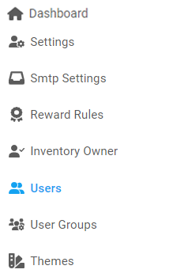

[Home](https://biijuwa.github.io/eckb/) / Users
{: .fs-2 }

##

---

### Create a user

1. From the **Dashboard**, select **Users.**

   

2. **Users** page opens up, click on the **Creat** button located on the top right corner.

   

3. **Create Users** page opens up, enter the required information in each field.

   

   > **NOTE:**   By default the status for a new user being created is set to **Active**. If you want to set is as **Inactive**, click on the **Toggle Button**.

4. Click on the **Create New User**.

<a href="#top" id="back-to-top">Back to top</a>

---
