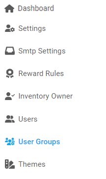

### Steps to create a USer Group

1. From the **Dashboard**, select **User Group**.

   

2. **User Groups** page opens up, click on the **Create button** located on the top right corner.

   

   > **NOTE:**   You can directly set the status of a particular usergroup by either toggling the button to **Active** or **Inactive.**

3. **User Group Create** page opens up, enter the required information in each field.

   

4. Click on the **Create User Group**.

<a href="#top" id="back-to-top">Back to top</a>

---
