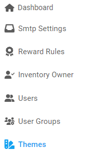

## Themes

---

### Steps to apply a theme

1. From the **Dashboard**, select **Themes**.

   

2. **Themes** page with all the available to use themes opens up, browse and select a theme.

   

3. To apply the selected theme, click on the 
4. **Confirmation** dialog opens up, click on **Yes** to apply the theme.

---

### Steps to Customize a theme
