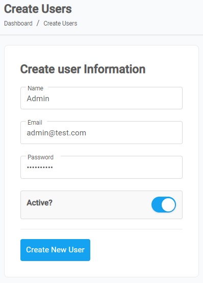

##

---

### Create a user

1. From the **Dashboard**, select **Users.**

    

2. **Users** page opens up, click on the **Creat** button located on the top right corner. 

    

3. **Create Users** page opens up, enter the required information in each field.

    

4. By default the status for the new user being created is set to **Active**, click on the **Toggle Button** to set it to **Inactive**. Or, else skip to next step.

5. Click on the **Create New User**.